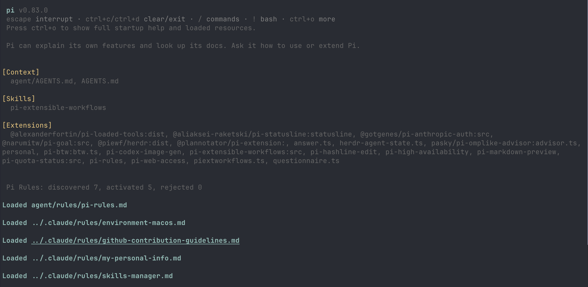
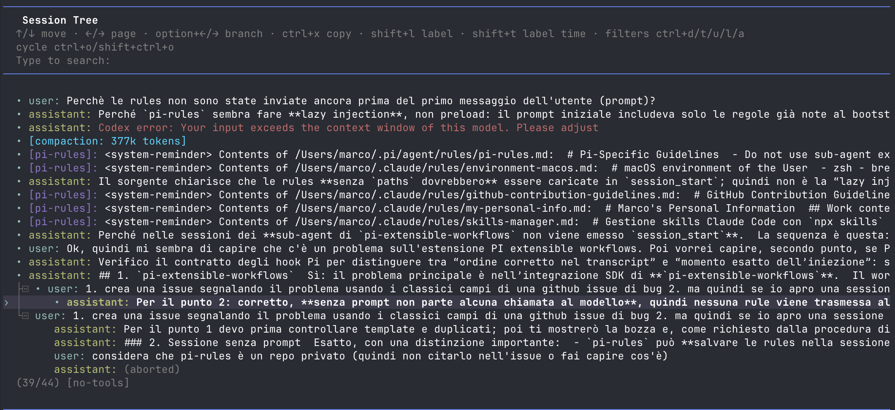

# pi-rules

**One collection. The right Rules, every time.**

Write your Rules once. Pi Rules automatically selects only the ones that apply to the current computer, operating system, and model—nothing more, nothing less.

Pi Rules is a [Pi](https://github.com/badlogic/pi-mono) extension compatible with existing Claude Code Rules collections.

## See it in action

### Transparent loading at startup

Pi Rules tells you exactly what it loaded and why. No guessing what context the model is carrying.



### Context that survives the session

Activated Rules are saved as `system-reminder` messages, so they stay in scope through resumes, forks, and compactions—and remain visible in Pi's session tree.



## Get started

### Install

**Requirements:** Pi with Node.js 22.19 or newer, Git, and npm.

```sh
pi install https://github.com/marcoscale98/pi-rules
```

SSH alternative: `pi install git:git@github.com:marcoscale98/pi-rules`

To update:

```sh
pi update --extensions
```

Then run `/reload` in Pi or restart it.

To try it without installing:

```sh
pi -e https://github.com/marcoscale98/pi-rules
```

### Write your first Rule

Drop a Markdown file in `~/.pi/agent/rules/` (or reuse your existing `~/.claude/rules/` collection):

```md
---
os: macos
---

Use Homebrew for package management.
```

That's it. On macOS it loads. Everywhere else it doesn't.

## Where Rules live

Pi Rules searches both Pi-native and Claude-compatible directories, so a single collection works across tools:

| Scope | Pi-native | Claude-compatible |
| --- | --- | --- |
| User | `~/.pi/agent/rules/` | `~/.claude/rules/` |
| Project | `.pi/rules/` and its ancestors | `.claude/rules/` and its ancestors |

At the same scope, Pi-native Rules win over Claude-compatible ones with identical paths. Nearer projects override ancestors, and project Rules override user Rules. Project Rules are only loaded when Pi trusts the project.

## Conditional Rules

Frontmatter is optional—skip it and a Rule always loads. Add it to narrow when it applies:

```md
---
paths:
  - src/{*.ts,*.tsx}
os: [macos, linux]
models: openai/gpt-5*
---

Use the project's TypeScript conventions when changing these files.
```

Three conditions, three different jobs:

| Condition | What it's for | When it activates |
| --- | --- | --- |
| `paths` | File-specific instructions (Claude Code compatible) | After Pi reads a matching file with its built-in `read` tool |
| `os` | Computer environment context | On a matching OS (`macos`, `windows`, `linux`; `darwin`/`win32` are aliases; WSL counts as Linux) |
| `models` | Model-specific guidance | When the active model matches a `provider/id` glob |

Each condition accepts a string or a list. Within a condition: OR. Across conditions: AND. Rules without `paths` are evaluated at startup, on resume, on model switch, on reload, and after compaction.

### `os` — tell the agent about its environment

Different computers need different instructions. Use `os` to isolate them so a macOS-only Rule never leaks into a Linux session:

```md
---
os: macos
---

Use Homebrew for package management and zsh for shell commands.
```

Keep a matching Rule for each platform you use—`os: windows`, `os: linux`—with the right tooling for each.

### `models` — fill in what smaller models don't know

Larger models tend to handle conventions and tooling on their own. Smaller or less capable ones sometimes need a hand. Use `models` to target that extra guidance without burdening every session with it:

```md
---
models:
  - anthropic/claude-haiku*
  - openai/gpt-5.6-luna*
---

Always implement features using Test-Driven Development: write a failing test first, then write the minimum code to make it pass, then refactor.
Run the tests after each step and do not move on until they are green.
Never write implementation code without a corresponding test driving it.
```

A model like `openai/gpt-5.6-sol` that doesn't need this guidance simply won't match—and won't see it. Replace the example identifiers with the actual case-sensitive `provider/id` values from your Pi setup.

## What's under the hood

- Compatible with Claude Code Rules out of the box.
- Recursive discovery with deterministic precedence and collision handling.
- Path matching with `.gitignore` semantics, case-insensitive, with bounded brace expansion.
- OS support: macOS, Windows, Linux, Android, BSD variants, AIX, SunOS.
- Deduplication across branches and compactions—no external database needed.
- Fails closed: a malformed Rule warns instead of becoming unconditional.

Rules are advisory. They become model context, not security enforcement.

## More information

- [Full specification](specs/pi-rules.md)
- [GitHub issue](https://github.com/marcoscale98/pi-rules/issues/1)

## Development

To run from a local checkout:

```sh
npm install
pi --no-extensions --approve -e "$(pwd)/extensions/pi-rules/index.ts"
```

`--no-extensions` disables auto-discovered extensions; `--approve` trusts project-local Rules for that run.

Run the test suite:

```sh
npm install
npm test
```

Run the TypeScript check against the globally installed Pi API:

```sh
typecheck_config=$(mktemp)
trap 'rm -f "$typecheck_config"' EXIT
repo_root=$(pwd)
pi_root=$(npm root -g)
cat >"$typecheck_config" <<EOF
{
  "compilerOptions": {
    "target": "ES2022",
    "module": "ESNext",
    "moduleResolution": "bundler",
    "allowImportingTsExtensions": true,
    "skipLibCheck": true,
    "paths": {
      "@earendil-works/pi-coding-agent": ["$pi_root/@earendil-works/pi-coding-agent"]
    }
  },
  "files": [
    "$repo_root/extensions/pi-rules/index.ts"
  ],
  "include": [
    "$repo_root/extensions/pi-rules/*.ts"
  ]
}
EOF
tsc --noEmit --project "$typecheck_config"
```
